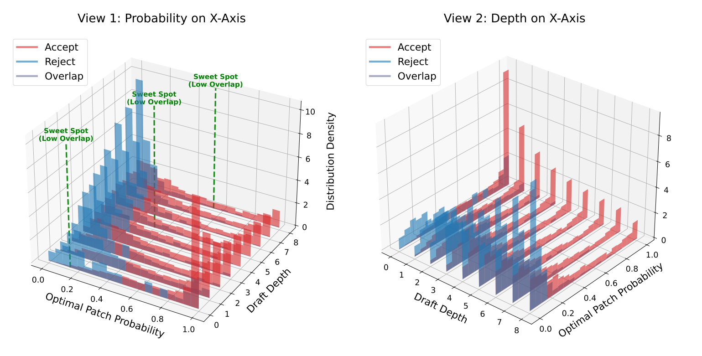

# ECHO_transformers



This repository provides a lightweight implementation of **ECHO: Elastic Speculative Decoding with Sparse Gating for High-Concurrency Scenarios** in transformers.

## Quick Start

Our implementation is based on a simple modification of EAGLE3. The transformer-level changes are intentionally lightweight: we select suitable sweet spots according to the acceptance distribution, enabling dynamic depth during speculative decoding.

## Environment Setup

```bash
cd EAGLE3/EAGLE3
pip install uv
uv venv -p 3.11 -i https://mirrors.cloud.tencent.com/pypi/simple
source .venv/bin/activate
uv pip install -r requirements.txt -i http://mirrors.aliyun.com/pypi/simple/ --trusted-host mirrors.aliyun.com
```

## Evaluation

Run the evaluation scripts under `eagle3/`, for example:

```bash
bash eagle3/eval.sh
```

You can configure the corresponding evaluation parameters directly in the related shell scripts, such as:

```bash
bash eagle3/eval_llama3_8b.sh
bash eagle3/eval_llama3_70.sh
bash eagle3/eval_qwen8b.sh
bash eagle3/eval_deepseek.sh
bash eagle3/eval_vicuna.sh
```

## Dynamic Depth

The early-exit or extension positions can be configured in `eagle3/model/cnets.py`, inside the `topK_genrate` function.

## Citation

If you find this repository useful, please cite:

```bibtex
@article{hu2026echo,
  title={ECHO: Elastic Speculative Decoding with Sparse Gating for High-Concurrency Scenarios},
  author={Hu, Xinyi and Shen, Yuhao and Zhang, Baolin and Zhang, Hengxin and Dai, Jun and Ge, Shuang and Chen, Lei and Li, Yue and Wan, Mingcheng},
  journal={arXiv preprint arXiv:2604.09603},
  year={2026}
}
```
